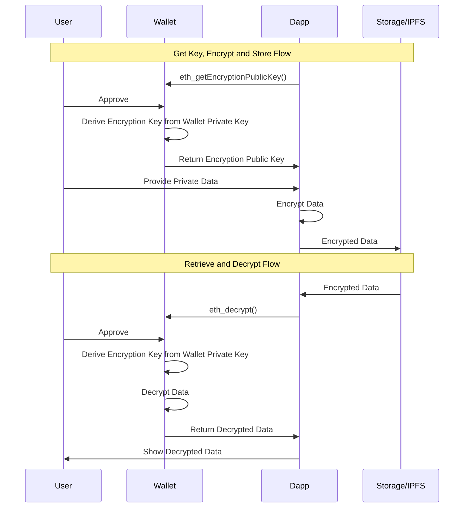

Deterministic Encryption and Storage via Snap and IPFS

# Background
For dapps to evolve, data needs to be stored in a way that is controlled by the user. There are several solutions to storing a user's data, including IPFS, however these solutions do not have guarantees of security and privacy which are necessary when it comes to user data. Dapps are evolving to use the user's wallet as their main identifier, but there are other powerful use cases lurking and the goal of this snap is to unlock on of them: user-controlled encryption and storage.

[EIP-5630](https://eips.ethereum.org/EIPS/eip-5630) defines a specification for encryption and decryption using deterministically derived, pseudorandom keys for wallets to implement. This snap implements the specification and provides a simple interface for encrypting and decrypting data. This include two methods: `eth_getEncryptionPublicKey` and `eth_decrypt`

## Example Flow

